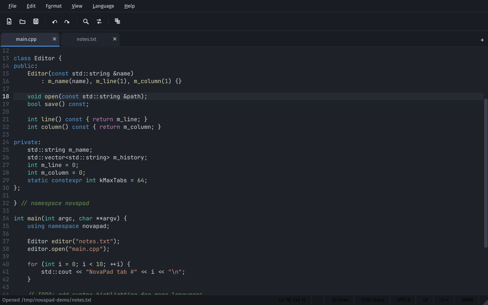
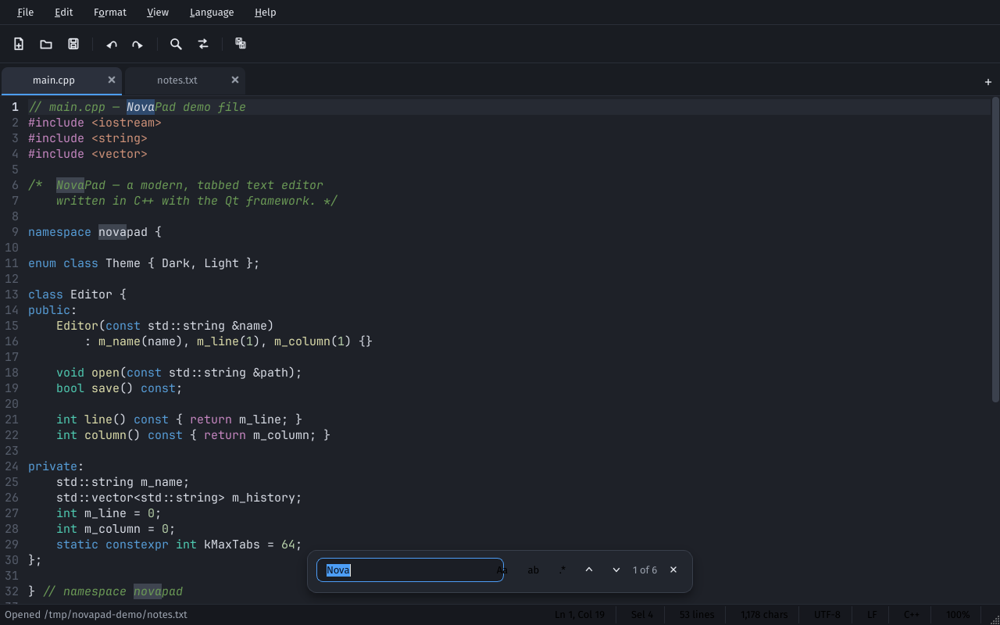
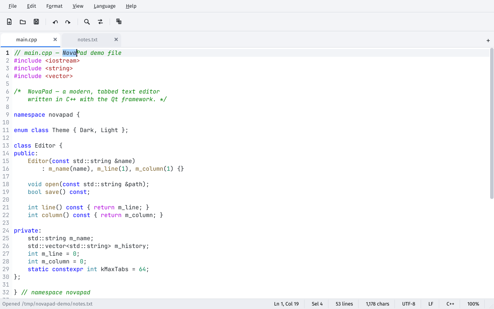

<div align="center">

# NovaPad

**A modern, Notepad / Notepad++ style text editor — built from scratch in C++17 with Qt.**

Fast. Tabbed. Dark. Bundled fonts. Zero dependencies at runtime.

[](https://github.com/SiktirStudio/txt-reader/actions/workflows/build.yml)
[](https://github.com/SiktirStudio/txt-reader/releases)
[](LICENSE)
[](https://isocpp.org/)
[](https://www.qt.io/)



</div>

---

## ✨ What is NovaPad?

NovaPad takes everything you know from **Windows Notepad** — and everything you wish it had from **Notepad++** — and wraps it in a clean, modern interface with a VS Code–inspired dark theme, rounded menus, floating find/replace card, and buttery-smooth typography (JetBrains Mono for code, Fira Sans for UI — both bundled inside the binary).

## 🖼️ Screenshots

| Dark theme + syntax highlighting | Find & Replace (floating card) |
|---|---|
|  |  |

| Light theme | |
|---|---|
|  | |

## 🚀 Features

### Everything in Notepad
- **File**: New, New Window, Open, Save, Save As, Page Setup, Print Preview, Print
- **Edit**: Undo/Redo, Cut/Copy/Paste/Delete, Find (F3 / Shift+F3), Replace, Go To Line, Select All, Time/Date (F5)
- **Format**: Word Wrap, Font… (live font picker for the whole editor)
- **View**: Zoom In / Out / Reset (Ctrl+mouse wheel too), Status Bar toggle
- UTF-8 by default, BOM detection & preservation, automatic fallback for non-UTF-8 (ANSI) files

### …plus the Notepad++ extras
- 🗂️ **Tabs** — movable, closable (✕ or middle-click), drag files onto the window to open them, double-click empty tab bar for a new tab, right-click tab menu (copy path, reveal in file manager…)
- 🌈 **Syntax highlighting for 13 languages** — C/C++, C#, Java, JavaScript/TypeScript, Python, JSON, HTML/XML, CSS, INI/TOML, Shell, CMake, Go, Rust — plus Plain Text; switch language per-tab from the **Language** menu
- 🔍 **Find & Replace panel** — match case, whole word, **regular expressions** with back-references (`\1`, `$1`), live match highlighting, `n of m` counter, Replace All as a single undo step
- #️⃣ **Editor niceties** — line numbers, current-line highlight, occurrences of the selected word, auto-indent, smart brace handling, Tab / Shift+Tab block indent, move/duplicate/delete line, toggle comment, trim trailing whitespace, UPPER/lower/Title/iNVERT case
- 🧭 **Go To Line** dialog, **Document Statistics** (lines / words / chars)
- 📁 **Recent files**, **session restore** (reopens your tabs on launch), **auto-reload** when a file changes on disk
- 🌗 **Two polished themes** — Nova Dark (VS Code Dark+ palette) and Nova Light, switchable instantly
- ↩️ **EOL handling** — LF / CRLF conversion & status, encoding (UTF-8 / UTF-8-BOM) per tab
- 🖨️ Full printing support with preview (system printer or print-to-PDF)

### Under the hood
- Pure **C++17 / Qt Widgets** — no QML, no web engine, tiny memory footprint
- **Fonts embedded in the executable** (JetBrains Mono + Fira Sans, both SIL OFL) — identical look on every machine
- Ships with a built-in **self-test suite** (`novapad --selftest`, 36 checks) that CI runs on every build

## ⌨️ Keyboard shortcuts

| Shortcut | Action | Shortcut | Action |
|---|---|---|---|
| `Ctrl+N` | New tab | `Ctrl+F` / `F3` | Find / Find next |
| `Ctrl+Shift+N` | New window | `Ctrl+H` | Replace |
| `Ctrl+O` | Open | `Ctrl+G` | Go to line |
| `Ctrl+S` / `Ctrl+Shift+S` | Save / Save as | `F5` | Insert time/date |
| `Ctrl+Alt+S` | Save all | `Ctrl+A` | Select all |
| `Ctrl+W` / `Ctrl+Shift+W` | Close tab / all | `Ctrl+D` | Duplicate line |
| `Ctrl+Tab` | Next tab | `Ctrl+L` | Delete line |
| `Alt+↑` / `Alt+↓` | Move line up/down | `Ctrl+/` | Toggle comment |
| `Ctrl+=` / `Ctrl+-` / `Ctrl+0` | Zoom in/out/reset | `Ctrl+Shift+U/L` | UPPERCASE / lowercase |
| `Ctrl+Z` / `Ctrl+Y` | Undo / Redo | `Esc` | Close find panel |

## 📦 Download

Grab a ready-made build from the [**Releases**](https://github.com/SiktirStudio/txt-reader/releases) page:

| Platform | Asset |
|---|---|
| Windows 10/11 (x64) | `NovaPad-v…-Windows-x64.zip` — unzip and run `novapad.exe` |
| Linux (x64) | `NovaPad-v…-Linux-x64.tar.gz` — untar and run `novapad` |
| macOS (Apple Silicon) | `NovaPad-v…-macOS-arm64.dmg` |

## 🔨 Build from source

Requirements: **CMake ≥ 3.21**, a C++17 compiler, and **Qt ≥ 6.2** (`qtbase` with Widgets + PrintSupport).

```bash
# Debian/Ubuntu: sudo apt install build-essential cmake ninja-build qt6-base-dev
git clone https://github.com/SiktirStudio/txt-reader.git
cd txt-reader
cmake -B build -DCMAKE_BUILD_TYPE=Release
cmake --build build --parallel
./build/bin/novapad
```

Windows (MSVC + Qt installed via the Qt online installer):

```bat
cmake -B build -DCMAKE_BUILD_TYPE=Release
cmake --build build --config Release --parallel
build\bin\novapad.exe
```

## 🗺️ Project layout

```
├── CMakeLists.txt          build definition (Qt6, single target)
├── resources/              app icon, .ico, embedded fonts (qrc)
├── .github/workflows/      CI: build + self-test + release binaries (Win/Linux/macOS)
└── src/
    ├── main.cpp            entry point, embedded fonts, CLI flags
    ├── mainwindow.*        menus, toolbar, tabs, session, printing, search wiring
    ├── editor.*            QPlainTextEdit + gutter, zoom, line ops, auto-indent
    ├── highlighter.*       hand-written multi-language syntax scanner
    ├── languages.*         declarative language definitions (13 languages)
    ├── findpanel.*         floating find/replace card
    ├── themes.*            dark/light palettes + full QSS stylesheet
    ├── icons.*             all toolbar icons drawn programmatically
    ├── search.*            find/replace engine (regex, backrefs, replace-all)
    └── fileio.*            encoding/BOM/EOL-safe load & save
```

## 📄 License

Code is released under the [MIT License](LICENSE).
The bundled fonts ([JetBrains Mono](resources/fonts/LICENSE-JetBrainsMono.txt), [Fira Sans](resources/fonts/LICENSE-Fira.txt)) are licensed under the SIL Open Font License 1.1.

---

<div dir="rtl" align="center">

## 🇮‌🇷 فارسی

**نووپد** یک ویرایشگر متن مدرن و شبیه به Notepad و Notepad++ ویندوز است که کاملاً با **زبان ++C** و کتابخانه Qt نوشته شده است.

### قابلیت‌ها
- **تمام امکانات Notepad**: فایل جدید/باز کردن/ذخیره/چاپ، Undo/Redo، برش/کپی/چسباندن، جستجو، جایگزینی، رفتن به خط، درج تاریخ و ساعت (F5)، شکستن خط (Word Wrap)، تغییر فونت، زوم
- **تب‌ها** مثل Notepad++: جابه‌جایی، بستن با کلیک وسط، کشیدن و رها کردن فایل روی پنجره
- **رنگ‌بندی کد برای ۱۳ زبان** برنامه‌نویسی شامل ++C، پایتون، جاوااسکریپت، HTML، CSS، Go، Rust و…
- **جستجو و جایگزینی پیشرفته** با پشتیبانی از Regex و هایلایت زندهٔ نتایج
- شمارهٔ خطوط، هایلایت خط جاری، تورفتگی هوشمند، جابه‌جایی/تکثیر/حذف خط، کامنت‌کردن خودکار
- **دو تم زیبا**: تیره (الهام‌گرفته از VS Code) و روشن
- بازگشت خودکار فایل‌های باز (Session) و بارگذاری مجدد خودکار هنگام تغییر فایل
- نمایش Encoding و نوع پایان خط (CRLF/LF) و تبدیل آن‌ها
- فونت‌ها داخل خود برنامه تعبیه شده‌اند و در همهٔ سیستم‌ها یکسان نمایش داده می‌شوند

### اجرا و ساخت
از بخش [Releases](https://github.com/SiktirStudio/txt-reader/releases) نسخهٔ آمادهٔ ویندوز، لینوکس یا مک را دانلود کنید، یا از سورس بسازید:

```bash
sudo apt install build-essential cmake ninja-build qt6-base-dev
git clone https://github.com/SiktirStudio/txt-reader.git
cd txt-reader
cmake -B build -DCMAKE_BUILD_TYPE=Release
cmake --build build --parallel
./build/bin/novapad
```

</div>
